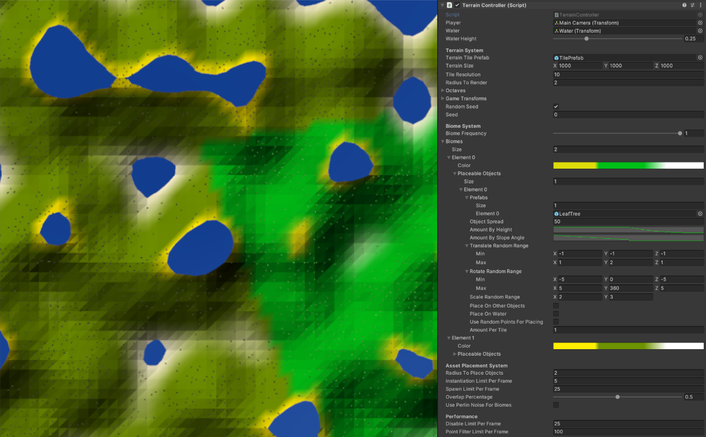

# 3D Procedural Terrain with Biomes for Mobile
This is a simple procedural terrain generator for the Unity 3D game engine, geared towards mobile game development. Developed on Unity 2020.1.2f1. The base for this project was inspired by [this procedural terrain implementation](https://www.youtube.com/watch?v=f9uueg_AUZs) by Adam Zmudzinski.

## Key Features
- Endless **Biomes** using a **Voronoi Diagram** implementation.
- **Asset Placement** with even distribution using **Poisson Disc Sampling**.
- **Coroutines** are used to eliminate lag spikes by splitting the workload between many frames.
- **Control** on **Performance** factors from inspector.

## How to implement this into your project
1. **Import** ProceduralTerrainForMobile folder into your project.
2. **Create** an empty GameObject in a scene and add TerrainController.cs to it.
3. **Assign** Player, Water, TilePrefab and the first biome's prefab on the TerrainController.

## Example Scene Screenshots

## License
MIT
